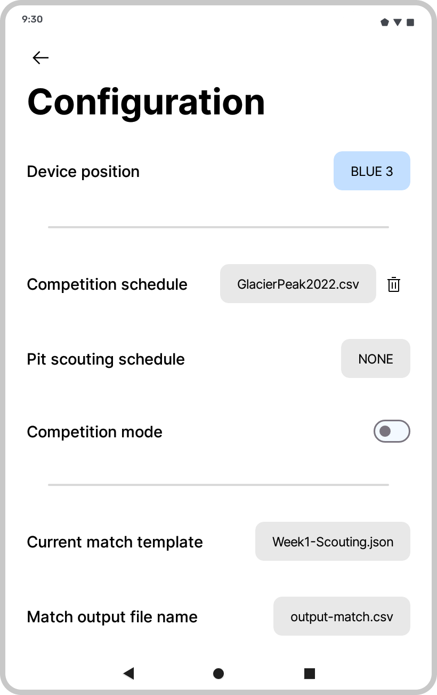

# Scouting
🤖 FRC scouting app that allows you to create templates, do pit scouting and use scouting schedules while being highly flexible and adaptable.

## How does it work?
This app isn't game or year specific. Instead of creating a new app every year which requires extra, unneccessary work, this app works for any game, any year. Simply create a template using the built-in editor to create a personalized pit and/or match scouting template that works for your team, and select it in the settings menu. That's it. If you choose to change what data your team is collecting when scouting at different events, simply create another template and use it. It's fast, easy and requires no coding knowledge. 

## Screenshots
<div class="flex" align="center">
  
  
  
  
</div>

## Features
- Drag and drop template editor
- Separate lists for autonomous and teleoperated stages
- Pit & Match scouting
- Load match schedules / assign pits to scout
- Customize order that data appears in output file
- Save to CSV file (openable in Excel, Google Sheets, etc.)
- Doesn't require internet access

## How to use
See the documentation (WIP) for instructions on how to use all features of the app 🤓

## External libraries used
- [google/accompanist](https://github.com/google/accompanist)
- [aclassen/ComposeReorderable](https://github.com/aclassen/ComposeReorderable)
- [tencent/MMKV](https://github.com/tencent/MMKV)
- [abhishekti7/UnicornFilePicker](https://github.com/abhishekti7/UnicornFilePicker)
- [google/gson](https://github.com/google/gson)

## Build notes
If you intend to build this project, make sure that you are using [Android Studio Flamingo](https://developer.android.com/studio/preview) or newer and that you have Java 11. This app is compatible with Android 5.0 (SDK 21) and any newer versions, and is designed for tablets with a screen size of at least 7.0" 

## License
```
Copyright 2023 Sebastian Hriscu

Licensed under the Apache License, Version 2.0 (the "License");
you may not use this file except in compliance with the License.
You may obtain a copy of the License at

http://www.apache.org/licenses/LICENSE-2.0

Unless required by applicable law or agreed to in writing, software
distributed under the License is distributed on an "AS IS" BASIS,
WITHOUT WARRANTIES OR CONDITIONS OF ANY KIND, either express or implied.
See the License for the specific language governing permissions and
limitations under the License.
```
